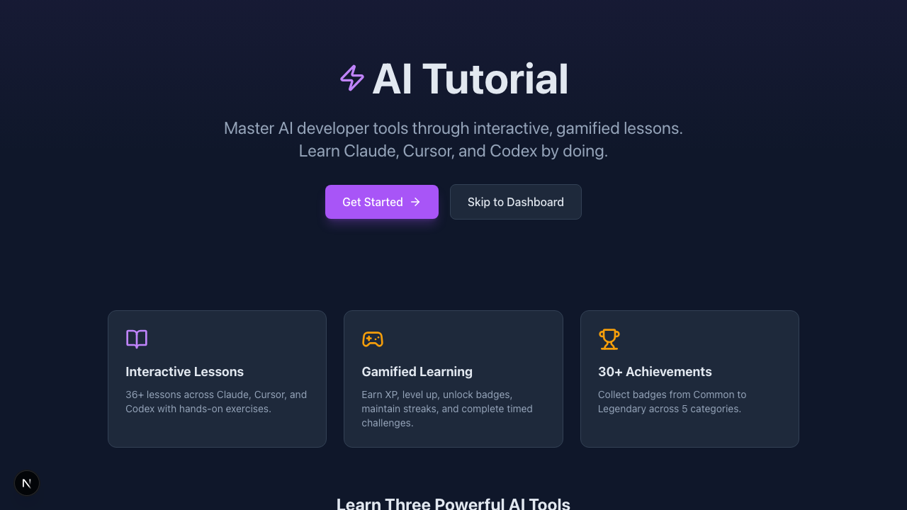
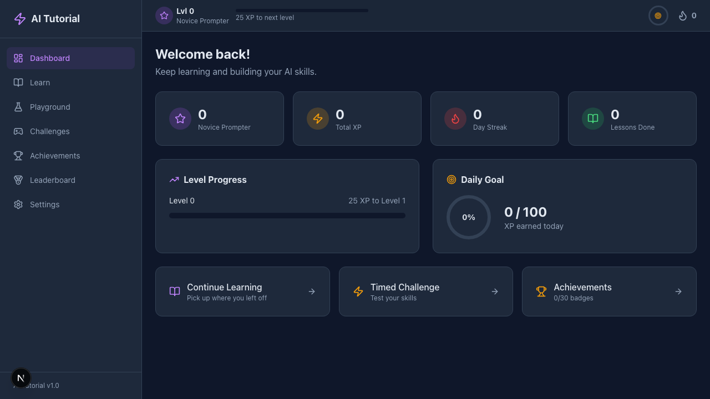
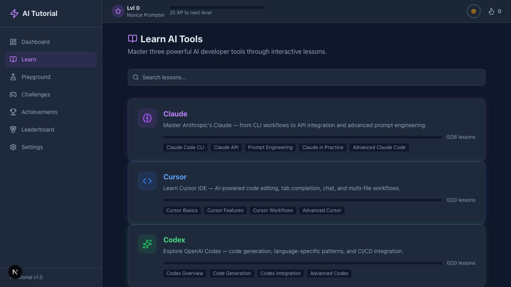
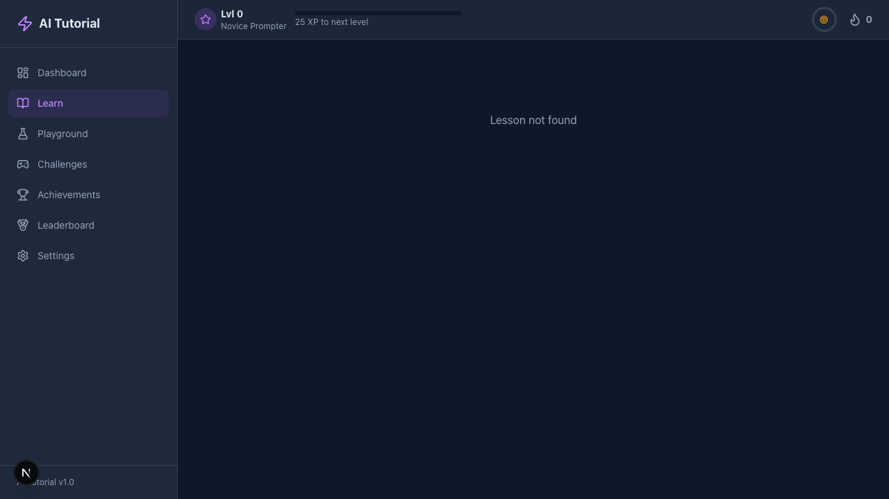
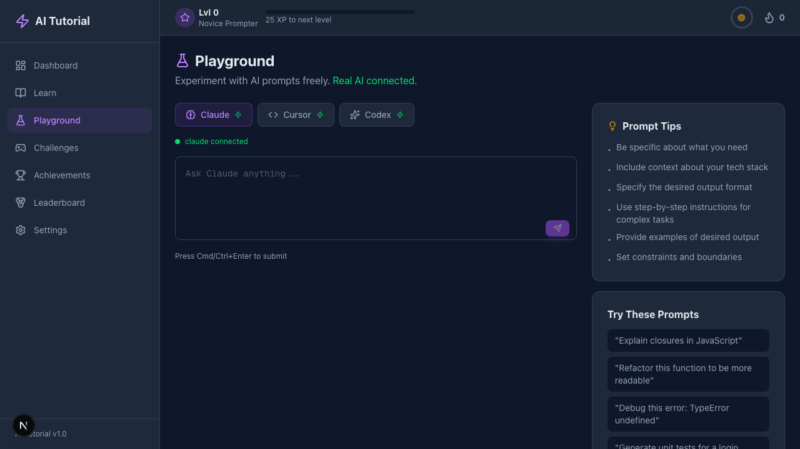
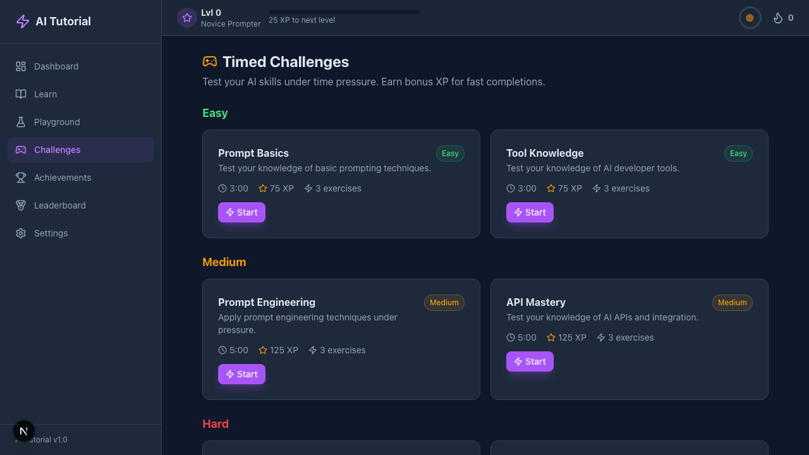
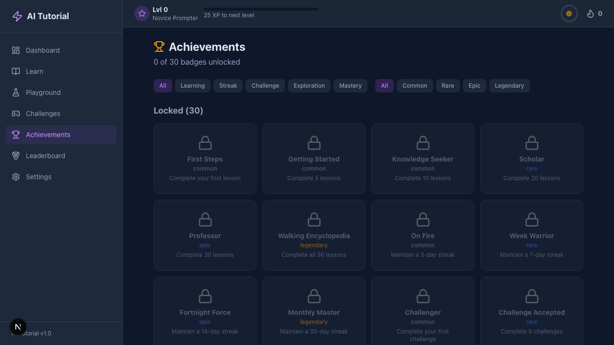
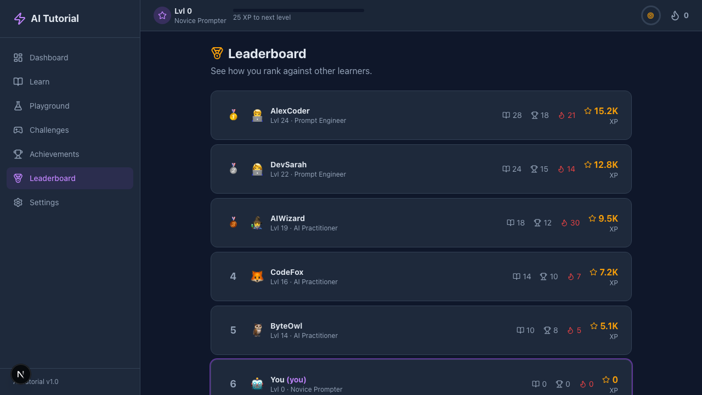

# AI Tutorial - Learn AI Tools Through Practice

> A gamified, interactive learning platform that teaches developers how to use AI tools (Claude, Cursor, Codex) through structured lessons, hands-on exercises, timed challenges, and a prompt engineering playground.

[](https://nextjs.org/)
[](https://reactjs.org/)
[](https://www.typescriptlang.org/)
[](https://tailwindcss.com/)
[](LICENSE)

## 🎯 Features

- 📚 **Structured Learning Path** - 33 lessons across 3 AI tools (Claude, Cursor, Codex)
- 🎮 **Gamification System** - XP, levels, streaks, daily goals, and 28 unlockable badges
- 🏆 **Timed Challenges** - Test your skills with easy, medium, and hard challenges
- 🎪 **Interactive Playground** - Experiment with AI prompts freely (simulated or live)
- 📊 **Progress Tracking** - Dashboard with stats, achievements, and leaderboard
- 🎨 **Modern UI** - Dark theme with beautiful animations and responsive design
- 💾 **No Backend Required** - All data persists in localStorage
- 🔌 **Optional Live AI** - Connect real AI CLI tools or use simulated responses

---

## 📸 Screenshots

### Landing Page


### Dashboard


### Learning Path


### Interactive Lesson


### Playground


### Challenges


### Achievements


### Leaderboard


---

## 🚀 Quick Start

### Prerequisites

- **Node.js** 18+ and npm
- **Git** for cloning the repository

### Installation

```bash
# Clone the repository
git clone https://github.com/yourusername/ai-tutorial.git
cd ai-tutorial

# Install dependencies
npm install

# Run development server
npm run dev
```

Open [http://localhost:3000](http://localhost:3000) in your browser. The app runs entirely client-side!

### Fork & Deploy

**Option 1: Fork on GitHub**
1. Click the "Fork" button on GitHub
2. Clone your fork: `git clone https://github.com/YOUR_USERNAME/ai-tutorial.git`
3. Install and run as above

**Option 2: Deploy to Vercel**

[](https://vercel.com/new/clone?repository-url=https://github.com/yourusername/ai-tutorial)

1. Click the button above
2. Sign in to Vercel
3. Deploy - it works out of the box!

**Option 3: Deploy to Netlify**

1. Fork this repo
2. Connect to Netlify
3. Build command: `npm run build`
4. Publish directory: `.next`

---

## 🎮 Usage

### First Time Setup

1. **Onboarding** - On first visit, you'll set up your profile and daily XP goal
2. **Choose Your Path** - Start with Claude, Cursor, or Codex lessons
3. **Complete Lessons** - Read content, complete exercises, earn XP
4. **Unlock Features** - Challenges unlock after completing 3 lessons
5. **Track Progress** - Check your dashboard for stats and achievements

### Learning Path

The curriculum is organized hierarchically:

```
Tool (Claude/Cursor/Codex)
  └── Module (e.g., "CLI Basics")
       └── Lesson (e.g., "Getting Started")
            ├── Content (markdown, code blocks, callouts)
            └── Exercises (quiz, prompt writing, code completion)
```

- **3 tools** with specialized content
- **10 modules** covering different aspects
- **33 lessons** with hands-on exercises
- **6 timed challenges** to test your skills

### Gamification

- **XP & Levels** - Earn XP from lessons, challenges, and perfect scores
- **Streaks** - Maintain daily activity for XP multipliers (up to 1.5x)
- **Badges** - 28 badges across 5 categories (Learning, Streak, Challenge, Exploration, Mastery)
- **Daily Goals** - Set and track daily XP targets
- **Leaderboard** - Compete with others (currently simulated)

---

## 🔧 Configuration

### Environment Variables (Optional)

The app works in **simulated mode** by default (no API calls required). To enable real AI tools:

1. Copy the example environment file:
   ```bash
   cp .env.example .env.local
   ```

2. Add your API keys:
   ```env
   ANTHROPIC_API_KEY=your_anthropic_key_here
   OPENAI_API_KEY=your_openai_key_here
   ```

3. Install CLI tools:
   ```bash
   # Claude CLI
   npm install -g @anthropic-ai/claude-code

   # Cursor (requires Cursor IDE)
   # Install from: https://cursor.sh

   # Codex CLI (if available)
   # Follow OpenAI documentation
   ```

4. Configure in **Settings** page
   - Enable each tool
   - Verify connection status
   - Test with playground

### Customization

#### Change Daily Goal Default
Edit `src/stores/useUserStore.ts`:
```typescript
dailyGoalXP: 500, // Change from 200
```

#### Add Custom Badges
Edit `src/data/badges.ts`:
```typescript
{
  id: 'custom-badge',
  name: 'Custom Achievement',
  description: 'Complete a custom task',
  category: 'mastery',
  rarity: 'epic',
  condition: { type: 'lessons_completed', value: 50 },
}
```

#### Modify XP Rewards
Edit lesson definitions in `src/data/modules/`:
```typescript
{
  id: 'my-lesson',
  title: 'My Lesson',
  xpReward: 100, // Change XP
  // ...
}
```

---

## 📦 Available Scripts

| Command | Description |
|---------|-------------|
| `npm run dev` | Start development server on port 3000 |
| `npm run build` | Build for production |
| `npm run start` | Serve production build |
| `npm run lint` | Run ESLint |
| `npm run screenshot` | Generate app screenshots (Playwright) |
| `npm run screenshot:install` | Install Playwright browsers |

---

## 🏗️ Tech Stack

| Layer | Technology | Purpose |
|-------|-----------|---------|
| **Framework** | Next.js 16 | App Router, client-side rendering |
| **UI Library** | React 19 | Interactive components |
| **Styling** | Tailwind CSS v4 | Utility-first CSS with custom theme |
| **Animations** | Framer Motion | Smooth transitions and effects |
| **State Management** | Zustand v5 | Lightweight state with persistence |
| **Code Editor** | CodeMirror | Syntax highlighting for exercises |
| **Charts** | Recharts | XP progress and stats visualization |
| **Markdown** | react-markdown + remark-gfm | Lesson content rendering |
| **Icons** | Lucide React | Beautiful icon library |
| **Notifications** | Sonner | Toast notifications |
| **Confetti** | canvas-confetti | Celebration animations |
| **Language** | TypeScript 5 | Type safety in strict mode |
| **Testing** | Playwright | Automated screenshots and E2E |

---

## 📂 Project Structure

```
ai-tutorial/
├── public/
│   ├── screenshots/        # App screenshots
│   └── ...                 # Static assets
├── src/
│   ├── app/               # Next.js App Router pages
│   │   ├── api/          # API routes (AI CLI integration)
│   │   ├── achievements/ # Badge gallery
│   │   ├── challenges/   # Timed challenges
│   │   ├── dashboard/    # Main dashboard
│   │   ├── learn/        # Learning paths
│   │   ├── leaderboard/  # Rankings
│   │   ├── onboarding/   # Setup flow
│   │   ├── playground/   # Prompt experimentation
│   │   ├── settings/     # User preferences
│   │   ├── layout.tsx    # Root layout
│   │   └── page.tsx      # Landing page
│   ├── components/
│   │   ├── ui/           # Reusable UI primitives
│   │   ├── layout/       # Navigation components
│   │   ├── gamification/ # XP, badges, streaks
│   │   ├── learning/     # Lesson and exercise components
│   │   └── playground/   # Prompt editor and response
│   ├── data/
│   │   ├── modules/      # Lesson content (claude/cursor/codex)
│   │   ├── badges.ts     # Badge definitions
│   │   ├── challenges.ts # Challenge definitions
│   │   ├── tools.ts      # Tool metadata
│   │   └── index.ts      # Data exports and helpers
│   ├── stores/
│   │   ├── useUserStore.ts      # User profile and XP
│   │   ├── useProgressStore.ts  # Lesson completion
│   │   ├── useBadgeStore.ts     # Badge tracking
│   │   ├── useChallengeStore.ts # Challenge attempts
│   │   ├── useStreakStore.ts    # Streak tracking
│   │   └── useAIStore.ts        # AI tool configuration
│   ├── hooks/
│   │   ├── useXP.ts      # XP award logic
│   │   └── useTimer.ts   # Challenge countdown
│   ├── lib/
│   │   ├── gamification.ts      # Level math, multipliers
│   │   ├── evaluator.ts         # Prompt scoring
│   │   ├── simulatedResponses.ts # Mock AI responses
│   │   ├── ai-client.ts         # Real AI integration
│   │   ├── storage.ts           # LocalStorage helpers
│   │   └── utils.ts             # Utility functions
│   └── types/
│       └── index.ts      # TypeScript types
├── scripts/
│   └── screenshot.spec.ts # Playwright screenshot tests
├── .env.example          # Environment variable template
├── playwright.config.ts  # Playwright configuration
├── package.json          # Dependencies and scripts
├── tsconfig.json         # TypeScript configuration
└── README.md            # This file
```

---

## 🎓 Key Concepts

### Architecture

- **Client-Side Only** - No server-side rendering, all pages use `'use client'`
- **LocalStorage Persistence** - All user data stored in browser (5 Zustand stores)
- **Simulated AI** - Keyword-based responses for offline learning
- **Optional Live AI** - Connect real CLI tools via API routes
- **Modular Content** - Lessons defined as TypeScript objects

### State Management

Five Zustand stores, all persisted to localStorage:

| Store | Purpose | Key |
|-------|---------|-----|
| `useUserStore` | Profile, XP, settings | `ai-tutorial-user` |
| `useProgressStore` | Lesson completion, exercise results | `ai-tutorial-progress` |
| `useBadgeStore` | Unlocked badges, unlock queue | `ai-tutorial-badges` |
| `useChallengeStore` | Challenge attempts, active challenge | `ai-tutorial-challenges` |
| `useStreakStore` | Daily streaks, last active date | `ai-tutorial-streak` |
| `useAIStore` | AI tool configuration | `ai-tutorial-ai` |

### Exercise Types

| Type | Component | Description |
|------|-----------|-------------|
| `multiple_choice` | `QuizQuestion` | Select correct answer |
| `prompt` | `PromptExercise` | Write and evaluate prompts |
| `code_completion` | `CodeCompletionExercise` | Fill in code blanks |
| `ordering` | `OrderingExercise` | Arrange items correctly |

---

## 🤝 Contributing

Contributions are welcome! Here's how to add content:

### Adding a New Lesson

1. Open the appropriate module file in `src/data/modules/<tool>/`
2. Add to the `lessons` array:
   ```typescript
   {
     id: 'my-lesson',
     title: 'My Lesson',
     description: 'Learn something new',
     xpReward: 50,
     estimatedMinutes: 10,
     content: [
       { type: 'markdown', content: '# Content here' },
       { type: 'code', language: 'typescript', code: 'const x = 1;' },
     ],
     exercises: [
       {
         id: 'q1',
         type: 'multiple_choice',
         question: 'What is X?',
         options: [
           { id: 'a', text: 'Answer A' },
           { id: 'b', text: 'Answer B' },
         ],
         correctAnswer: 'a',
         explanation: 'Because...',
       },
     ],
   }
   ```

### Adding a New Badge

Edit `src/data/badges.ts`:
```typescript
{
  id: 'new-badge',
  name: 'Badge Name',
  description: 'Unlock condition',
  category: 'learning', // learning, streak, challenge, exploration, mastery
  rarity: 'rare', // common, rare, epic, legendary
  condition: { type: 'lessons_completed', value: 25 },
}
```

### Adding a New Challenge

Edit `src/data/challenges.ts`:
```typescript
{
  id: 'new-challenge',
  title: 'Challenge Name',
  description: 'Challenge description',
  difficulty: 'medium',
  timeLimitMinutes: 10,
  xpReward: 200,
  exercises: [ /* exercise definitions */ ],
}
```

---

## 🐛 Troubleshooting

### Screenshots not generating?
```bash
npm run screenshot:install  # Install browsers
npm run screenshot          # Try again
```

### Dev server won't start?
```bash
rm -rf .next node_modules
npm install
npm run dev
```

### localStorage issues?
- Open browser DevTools > Application > Local Storage
- Clear `ai-tutorial-*` keys
- Refresh the page

### AI tools not connecting?
- Verify API keys in `.env.local`
- Check CLI tools are installed: `which claude`, `which cursor-agent`, `which codex`
- Test in Settings page with "Test Connection"

---

## 📄 License

This project is licensed under the MIT License - see the [LICENSE](LICENSE) file for details.

---

## 🙏 Acknowledgments

- **Next.js Team** - Amazing framework
- **Anthropic** - Claude AI and API
- **Cursor Team** - Awesome AI-powered editor
- **OpenAI** - Codex and GPT models
- **Tailwind CSS** - Beautiful utility-first CSS
- **All Contributors** - Thank you for your contributions!

---

## 🔗 Links

- **Documentation** - See inline code comments and this README
- **Issues** - Report bugs or request features on GitHub
- **Discussions** - Ask questions and share ideas

---

Made with ❤️ by developers, for developers. Happy learning!
